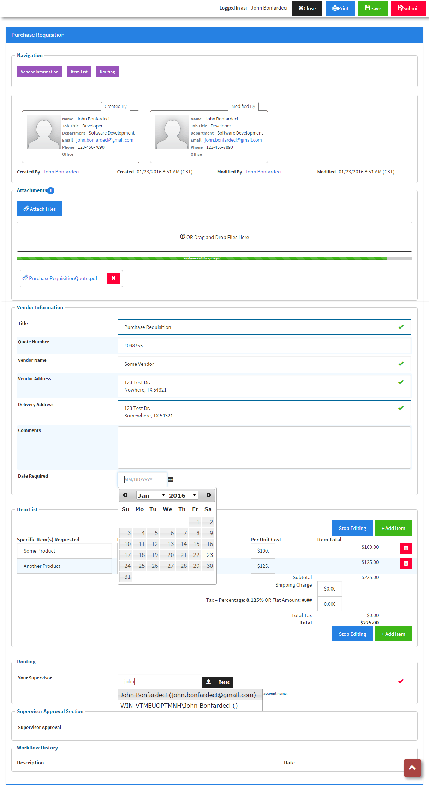
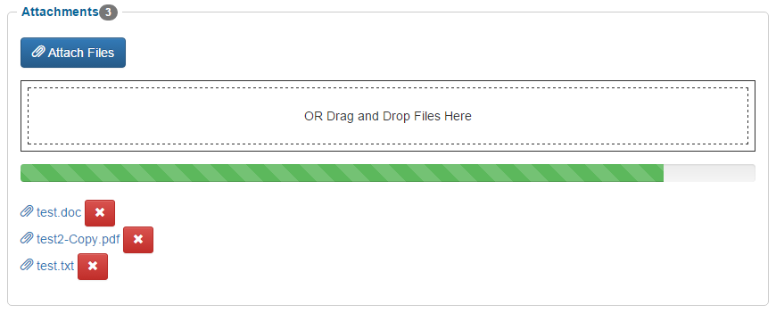

# Shockout SPForms
###SharePoint + Knockout MVVM forms - an InfoPath and XSL Form Replacement (and Vast Improvement)

Forget the frustrations of legacy InfoPath and XSL SharePoint form development. Leverage the power of Knockout's databinding plus SharePoint's REST services to create modern and truly dynamic web forms.

###Compatibilty
Compatible with SharePoint 2010 and 2013, Foundation, Standard, and Enterprise.

####Example Form shown with [Cosmo Theme](http://bootswatch.com/cosmo/bootstrap.min.css)


[View the source for this sample Purchase Requisition form.](https://github.com/jbonfardeci/ShockoutForms/blob/master/example/SP2013/PurchaseRequisition.aspx)

####Dependencies: 
jQuery 1.72+, jQuery UI<any>, KnockoutJS 3.2+

##Mobile First
Shockout SP Forms is built on the philosophy of Responsive Design and Mobile First. Therefore, the framework's built-in templates utilize Bootstrap CSS. You're encouraged to become familiar with Boostrap CSS and implement the classes in your own form controls. Download Boostrap at http://getbootstrap.com, or use the CDN (Content Delivery Network) links below. See the Knockout HTML form control samples below which include the Boostrap CSS classes.

##About Knockout JS MVVM (Model View View Model)
You must be familiar with the Knockout JS MVVM framework syntax, but there are form control samples below that you can copy and paste in order to get you started building Shockout forms with a minimal learning curve. Visit http://knockoutjs.com if you need an introduction or refresher.

Knockout utilizes the Observer/Observable design pattern which means that many objects can "observe" another object - called an "observable." This means when the value of an observable changes, all observers will react to the change. A practical example of this behavior is with Excel formula cells - the calculation updates immediately after another variable in the formula changes. 

###Rules
If you've spent any time implementing rules in InfoPath, you have probably become frustrated with the interface to manage those rules. Rules with XSL forms? Forget it unless you're prepared to hack your form to death with jQuery selectors and event handlers. With Knockout's directives, you can embed the functionality of rules in an HTML element with the data-bind attribute. For example, do you need to show an element based on the selected option of a select element?
```
<label>What is your favorite color?</label>
<select data-bind="value: color, optionsCaption: 'Select your favorite color...'">
	<option>Red</option>
	<option>Blue</option>
	<option>Green</option>
</select>

<!-- The div element below is absent from the DOM until `color == 'Red'` -->

<!-- ko if: color() == 'Red' -->
<div>What a coincidence. Red is my favorite color too!</div>
<!-- /ko -->

```

#### Usage
```
// These are included in the sample Master page provided - Shockout.SpForms.master
<!-- Bootstrap CSS (in head)-->
<link href="//maxcdn.bootstrapcdn.com/bootstrap/3.3.5/css/bootstrap.min.css" rel="stylesheet" type="text/css" />

<!-- jQuery UI CSS (in head)-->
<link href="//code.jquery.com/ui/1.11.4/themes/smoothness/jquery-ui.css" rel="stylesheet" type="text/css" />

<!-- It's recommended to place your scripts at the bottom of the page, before the ending </body> tag, for faster page loads. -->

<!-- jQuery -->
<script src="//code.jquery.com/jquery-1.11.3.min.js" type="text/javascript"></script>
<script src="//code.jquery.com/ui/1.11.4/jquery-ui.min.js" type="text/javascript"></script>

<!-- Bootstrap -->
<script src="//maxcdn.bootstrapcdn.com/bootstrap/3.3.5/js/bootstrap.min.js" type="text/javascript"></script>

<!-- Knockout JS -->
<script src="//cdnjs.cloudflare.com/ajax/libs/knockout/3.3.0/knockout-min.js" type="text/javascript"></script>

<!-- Shockout SPForms -->
<script src="ShockoutForms-1.0.1.min.js" type="text/javascript"></script>

<!-- Setup your form - this goes at the bottom of your form's page -->
<script type="text/javascript">

/////////////////
// Minimum Usage
/////////////////
(function(){
    var spForm = new Shockout.SPForm(
		/*listName:*/ 'My SharePoint List Name', 
		/*formId:*/ 'my-form-ID');
})();

////////////////////
// With All Options
////////////////////
(function(){
	var spForm = new Shockout.SPForm(
		/*listName:*/ 'My SharePoint List Name', 
		/*formId:*/ 'my-form-ID', 
		/*options:*/ {
			debug: false, // default false
            siteUrl: '', // default  
			preRender: function(spForm){}, // default undefined
			postRender: function(spForm){}, // default undefined
			preSave: function(spForm){}, // default undefined	
			allowDelete: false, // default false
			allowPrint: true, // default true
			allowSave: true, // default true
			confirmationUrl: '<siteUrl parameter>', // the default
            dialogOpts: { width: 400,
                height: 250,
                autoOpen: false,
                show: {
                    effect: "blind",
                    duration: 1000
                },
                hide: {
                    effect: "explode",
                    duration: 1000
                }
            }, // the default; see http://api.jqueryui.com/dialog/ for all options
			enableErrorLog: true, // default true
			errorLogListName: 'Error Log', // Designated SharePoint list for logging user and form errors; Requires a custom SP list named 'Error Log' on root site with fields: 'Title' and 'Error'
            errorLogSiteUrl: '/', // the default
            allowedExtensions: ['txt', 'rtf', 'zip', 'pdf', 'doc', 'docx', 'jpg', 'gif', 'png', 'ppt', 'tif', 'pptx', 'csv', 'pub', 'msg'],  // the default 
			attachmentMessage: 'An attachment is required.', // the default    
			enableAttachments: true, // default true, will be overridden by the SP list settings if attachments are disabled
            requireAttachments: false, // default false
			includeUserProfiles: true, // default true
			includeWorkflowHistory: true, // default true        
			workflowHistoryListName: 'Workflow History' // the default
		});
})();
</script>
```

###Attachments - SP 2010 and 2013
To enable attachments for your forms, include at least one `so-attachments` element within your form and ensure attachments are enabled on your list. An error message will be displayed if the browser doesn't support the FileReader class for uplaoding base64 strings to the lists.asmx/AddAttachment SOAP service.
    
    * Parameters:
     * `val` - ViewModel.attachments (KnockoutObservableArray<IViewModelAttachments>) 
     * `readOnly` - (Boolean | KnockoutObservable<Boolean>)
     * `title` - (string) display title to show in the module header
     * `label` - (string) label to show in the attachment button; default is "Attach Files"
     * `drop` - (Boolean) show a drag and drop zone; default is true
     * `dropLabel` - (string) default is "OR Drag and Drop Files Here"
     * `description` - (string) an optional descriptio to display under the control
     * `className` - (string) default is Bootstrap's "btn btn-primary" but you can override this class.

```
<so-attachments params="val: attachments"></so-attachments>
```



###Show the User Profiles for Created By and Modified By
To enable this feature, ensure that `includeUserProfiles` is `true` (the default) include an element with the class name "created-info" or attribute "data-sp-created-info". 
Shockout will query the User Information List or User Profile Service, if you have it, and display user profiles with: picture, full name, job title, email, phone, department, and office.
If this feature is disabled, Shockout will only show the Created By/Created and Modified By/Modified fields. 
```
<div class="created-info"></div>
    //OR
<div data-sp-created-info></div>
```

###SharePoint Field Variable Names
Shockout relies on SharePoint REST Services and SP REST Services returns your list's field names in a specific format; basically the current display name, minus spaces and special characters, in "CamelCase."

The Shockout framework will map these camel case variable names to an instance of a Knockout view model. You'll use these variable names to create your form's fields.

To preview the formatting of your SharePoint list's field names, it's very helpful to use a REST client such as the Advanced REST Client for Google's Chrome browser - https://chrome.google.com/webstore/detail/advanced-rest-client/hgmloofddffdnphfgcellkdfbfbjeloo

Once this application is installed, you can preview the JSON returned by entering the following in the address bar. Your list name must NOT contain spaces and must be in CamelCase
```
http://<SiteUrl>/<Subsite>/_vti_bin/listdata.svc/<MyListName>(<ID>)

// example: https://mysite.com/forms/_vti_bin/listdata.svc/PurchaseRequisitions(1)
```
Choose the GET radio option and enter `Accept: application/json;odata=verbose` in the RAW field. This tells SP to return JSON, not XML!
Now that you know the variable names, you're ready to create your Shockout form.

###SP Field Metadata
* Shockout assigns metadata properties to all of your list fields.

    * `_koName` - (String) - the Knockout variable name
    * `_name` - (String) the internal name of the SP field
    * `_options` - (Array) if the field is a choice or multichoice field, the field's choices 
    * `_description` (String) the decription of the SP field
    * `_required` (Boolean) if the field is required or not
    * `_readOnly` (Boolean) if the field is read-only or not
    * `_format` (String) the standard name of the type of SP field: Text, Choice, Note, Computed, etc.

##Default Field Templates with Knockout Components
(Thanks to John Kerski at Definitive Logic for the recommendation!)

KO Components are really amazing. Visit the KO docs to learn more about them http://knockoutjs.com/documentation/component-overview.html

###SharePoint Fields
```
    <!-- Single line of text -->
    <so-text-field params="val: MySpField"></so-text-field>

    <!-- Multline Textarea -->
    <so-text-field params="val: MySpField, multiline: true"></so-text-field>

    <!-- Shows user profile names with jQuery UI auto-complete. -->
    <so-person-field params="val: MySpField"></so-person-field>

    <!-- Show integer. -->
    <so-number-field params="val: MySpField"></so-number-field>

    <!-- Show decimal points; 2 places by default, pass 'precision: <num>' to override. -->
    <so-decimal-field params="val: MySpField"></so-decimal-field>

    <!-- Show currency. -->
    <so-money-field params="val: MySpField"></so-money-field>

    <!-- For rich text fields. -->
    <so-html-field params="val: MySpField"></so-html-field>

    <!-- With jQuery Datepicker. -->
    <so-date-field params="val: MySpField"></so-date-field>

    <!-- JQuery Datepicker plus Time controls. -->
    <so-datetime-field params="val: MySpField"></so-datetime-field>

    <!-- Attachments -->
    <so-attachments params="val: attachments"></so-attachments>

```
* Optional Parameters
    * label: string (default is the field's display name defined in the SharePoint field; can pass HTML)
    * id: string (default is the field's static name defined in the SharePoint field)
    * title: string (default undefined)
    * maxlength: number (default = 255)
    * description: string (default is Description defined in the SharePoint field; pass null/false to hide; can pass HTML)
    * placeholder: string
    * required: boolean | KO observable (default = ko.observable(false))
    * readOnly: boolean | KO observable (default = ko.observable(false))
    * labelColWidth: number (default = 3, Bootstrap grids are up to 12 units wide)
    * fieldColWidth: number (default = 9, if you only provide the labelColWidth, the fieldColWidth will be computed `12 - labelColWidth`)
    * multiline: boolean (default = false; for so-text-field only)

###SharePoint Checkbox Field (Boolean)
```
<so-checkbox-field params="val: MySpField"></so-checkbox-field>
```
* Optional Parameters
    * label: string (default is the field's display name defined in the SharePoint field)
    * id: string (default is the field's static name defined in the SharePoint field)
    * title: string (default undefined)
    * description: string (default is Description defined in the SharePoint field; pass null/false to hide)
    * required: boolean | KO observable (default = ko.observable(false))
    * readOnly: boolean | KO observable (default = ko.observable(false))
    * labelColWidth: number (default = 3, Bootstrap grids are up to 12 units wide)
    * fieldColWidth: number (default = 9, if you only provide the labelColWidth, the fieldColWidth will be computed `12 - labelColWidth`)

###SharePoint Choice Fields - Select Menu
How to display the choices from a SharePoint Choice Field in a select menu.
```
<so-select-field params="val: MySpField"></so-select-field>
```
* Optional Parameters
    * label: string (default is the field's display name defined in the SharePoint field)
    * id: string (default is the field's static name defined in the SharePoint field)
    * title: string (default undefined)
    * caption: string (default undefined)
    * options: Array (default is the choices defined in the SharePoint list)
    * description: string (default is Description defined in the SharePoint field; pass null/false to hide)
    * required: boolean | KO observable (default = ko.observable(false))
    * readOnly: boolean | KO observable (default = ko.observable(false))
    * labelColWidth: number (default = 3, Bootstrap grids are up to 12 units wide)
    * fieldColWidth: number (default = 9, if you only provide the labelColWidth, the fieldColWidth will be computed `12 - labelColWidth`)

###SharePoint MultiChoice Fields - Checkboxes
How to display the choices from a SharePoint MultiChoice Field with checkboxes.
```
<so-checkbox-group params="val: MySpField"></so-checkbox-group>
```
* Optional Parameters
    * label: string (default is the field's display name defined in the SharePoint field)
    * id: string (default is the field's static name defined in the SharePoint field)
    * title: string (default undefined)
    * description: string (default is Description defined in the SharePoint field; pass null/false to hide)
    * inline: boolean (default = false)
    * readOnly: boolean | KO observable (default = ko.observable(false))
    * labelColWidth: number (default = 3, Bootstrap grids are up to 12 units wide)
    * fieldColWidth: number (default = 9, if you only provide the labelColWidth, the fieldColWidth will be computed `12 - labelColWidth`)

###SharePoint MultiChoice Fields - Radio Buttons
How to display the choices from a SharePoint MultiChoice Field with radio buttons.
```
<so-radio-group params="val: MySpField"></so-radio-group>
```
* Optional Parameters
    * label: string (default is the field's display name defined in the SharePoint field)
    * id: string (default is the field's static name defined in the SharePoint field)
    * title: string (default undefined)
    * description: string (default is Description defined in the SharePoint field; pass null/false to hide)
    * inline: boolean (default = false)
    * readOnly: boolean | KO observable (default = ko.observable(false))
    * labelColWidth: number (default = 3, Bootstrap grids are up to 12 units wide)
    * fieldColWidth: number (default = 9, if you only provide the labelColWidth, the fieldColWidth will be computed `12 - labelColWidth`)

     
###Multiple Persons (UserMulti)
####A Control with Multiple User Accounts

```
<so-usermulti-field params="val: MySpField"></so-usermulti-field>
```
* Optional Parameters
    * label: string (default is the field's display name defined in the SharePoint field)
    * id: string (default is the field's static name defined in the SharePoint field)
    * title: string (default undefined)
    * description: string (default is Description defined in the SharePoint field; pass null/false to hide)
    * required: boolean | KO observable (default = ko.observable(false))
    * readOnly: boolean | KO observable (default = ko.observable(false))

##Required Field Validation
Simply add the `required` attribute to required field elements (if not using a standard SO, so-*-field, component). Shockout will do the rest!

##Knockout SharePoint Field Binding Handlers
You may use these binding handlers with any HTML element. Shockout will render the apporpriate content whether it's a static element such as a DIV, SPAN, etc. or an input field: INPUT, SELECT, and TEXTAREA.
	
####data-sp-html
```
<textarea data-bind="value: Comments" data-sp-html></textarea>
``` 

####spPerson
Displays an auto-complete field with user name and email address as you type a user's first or last name in the field. The minimum number of characters is 3 before it will query the User Information List.
SharePoint group names aren't supported at this time, but coming soon.
```
<input type="text" data-bind="spPerson: myVar" />
<div data-bind="spPerson: myVar"></div>
```

####spDate
Displays a date in MM/DD/YYYY format.
```
<input type="text" data-bind="spDate: myVar" />
<div data-bind="spDate: myVar"></div>
```

####spDateTime
Displays a date/time in MM/DD/YYYY HH:MMM TT format.
```
<input type="text" data-bind="spDateTime: myVar" />
<div data-bind="spDateTime: myVar"></div>
```

####spMoney
Displays currency in USD. Negative values are displayed in red and enclosed in parenthesis `()`. Other currency symbols coming soon.
```
<input type="text" data-bind="spMoney: myVar" />
<div data-bind="spMoney: myVar"></div>
```

####spDecimal
Displays number with 2 decimal places. Negative values are displayed in red. You can change the decmial places with the precision attribute.
```
<input type="text" data-bind="spDecimal: myVar, precision: 2" />
<div data-bind="spDecimal: myVar, precision: 2"></div>
```

####spNumber
Displays integer/whole number. Negative values are displayed in red.
```
<input type="text" data-bind="spNumber: myVar" />
<div data-bind="spNumber: myVar"></div>
```

##Element Attributes

####data-author-only
Restricts element to authors only where `currentUser.id == listItem.CreatedById`. Removes from DOM otherwise.
Useful for restricting edit fields to the person that created the form.

Shockout will render a Knockout IF containerless control around your element: e.g.
```
<!-- ko if: !!$root.isAuthor() -->
    <div data-author-only></div>
<!-- /ko -->
```

```
<section data-author-only></section>
```

####data-non-authors
Restricts element to non-authors of a form. Removes from DOM otherwise. 
Useful for displaying read-only/non-edit sections to non-authors only.
```
<section data-non-authors></section>
```

####data-edit-only
Only renders an element when there's an ID in the querystring - an existing form. Removes from DOM otherwise. 
Useful for sections that require another person's input (such as comment and approval sections) on an existing form.
```
<section data-edit-only></section>
```

####data-new-only
Only renders an element when there is NO ID in the querystring - a new form. Removes from DOM otherwise.
```
<section data-new-only></section>
```

####data-sp-groups
Only renders an element for users belonging to the specified SharePoint user groups. Removes from DOM otherwise.
Useful for restricting access to manager approval sections and fields.
// Value is a comma delimitted list of user group IDs and names: `<groupId>;#<groupName>`. Shockout SPForms will first try to match on group ID and then the group name.
```
// Example:
<section data-sp-groups="1;#Administrators,2;#Managers"></section>
```

For approval sections, you can combine these attributes:
```
<section data-edit-only data-sp-groups="1;#Administrators,2;#Managers"></section>
```
This element will be rendered for users who belong to the SP user groups specified and only when there is an ID in the querystring of the form URL. 

##Form Events
You may further customize your form by adding extra functionality within the appropriate event methods. 
You specify the code for these methods in the third parameter of the constructor - the options object.

####preRender()
```
preRender: function(spForm){
	// Run custom code here BEFORE the form is rendered and BEFORE the Knockout view model is bound.
	// Useful for adding custom markup and/or custom local Knockout variables to your form.
	// Shockout will know the difference between your variables and the ones that exist in your SharePoint list.
}
```

####postRender()
```
postRender: function(spForm){
	// Run custom code here AFTER the form is rendered and AFTER the Knockout view model is bound.
	// Useful for:
	//	- setting default values for your Knockout objects
	//	- using JSON.parse() to convert string data stored in a text field to JSON - think tables in InfoPath but with JSON instead of XML!
}
```

####preSave()
```
preSave: function(spForm){
	// Run code before the form is saved.
	// Useful for: 
	//	- implementing custom validation
	//	- converting JSON data to a string with JSON.stringify(), which is saved in a plain text field.
}	
```

##Saving vs. Submitting Forms
Shockout includes a feature that allows your users to save their forms before submitting and triggering approval workflows. This is very useful for long forms - I know our users, especially managers, are interupted constantly 
and leave their forms open so long their sessions used to time out. 

To enable this feature, you must: 
  * Have a field of type `boolean` named "IsSubmitted" in your form's list. 
  * Shockout will detect this field and render a 'Save' button next to the 'Submit' button.
  * To prevent your approval workflows from triggering until the user presses the Submit button, include in the beginning of your workflows: 
		```
		Wait on 'IsSubmitted' to equal 'Yes'
		```   

##Workflow History
If your form has one or more workflows, Shockout will display all logs from your site's Workflow History list at the bottom of your form. This is a very helpful feature for your users to track the status of their forms.
The Workflow History list is hidden by default and can be made visible a coupe of ways. You can view your site's Workflow History list at `http://<mysite.com>/Lists/Workflow%20History`.

Warning: Workflow HIstory lists can qickly become full, exceeding your list threshold for non-admin users. Be sure to run regular maintenance to delete old list items. I use a PowerShell script which runs in the front-end server's Task Scheduler, nightly, to delete list items older than 6 months.

The option `includeWorkflowHistory` is `true` by default but you may override and set it to `false`. 

The option `workflowHistoryListName` is "Workflow History" by default since all SharePoint sites feature this list. You may override this list name if you've created another custom workflow history list but it must be of the same list template.

##Error Logging
This feature allows you to track and fix any errors your users experience. The default options are `enableErrorLog: true`, `errorLogListName: 'Error Log'`, and `errorLogSiteUrl: '/'`. 

Your Error Log list must have 2 fields: "Title" (text) and "Error" (multiple lines of text - rich HTML). 

It's recommended to set a workflow or an alert on this list to notify you as soon as an error is logged.   

##Supported Browsers
Shockout has been successfully tested with IE 10-11 (*should* work with Edge) and the latest versions of Chrome and FireFox. Support for IE9 was dropped in favor of the new HTML 5 file uploader. Plus we want to discourage Win XP stalwarts.

##Static Data Access Methods
 * Read the JavaDoc comments above each method for usage.
  * SharePoint 2010/13 REST methods: <https://github.com/jbonfardeci/ShockoutForms/blob/master/TypeScript/e_spApi.ts>
  * SharePoint 2013 REST API methods: <https://github.com/jbonfardeci/ShockoutForms/blob/master/TypeScript/f_spApi15.ts>
  * SharePoint SOAP methods: <https://github.com/jbonfardeci/ShockoutForms/blob/master/TypeScript/g_spSoap.ts>

###Copyright
The MIT License (MIT)
    
<https://tldrlegal.com/license/mit-license>

Copyright (c) 2015 John T. Bonfardeci
     
Permission is hereby granted, free of charge, to any person obtaining a copy of this software and associated documentation files (the "Software"), to deal in the Software without restriction, including without limitation the rights to use, copy, modify, merge, publish, distribute, sublicense, and/or sell copies of the Software, and to permit persons to whom the Software is furnished to do so, subject to the following conditions:
 
The above copyright notice and this permission notice shall be included in all copies or substantial portions of the Software.

THE SOFTWARE IS PROVIDED "AS IS", WITHOUT WARRANTY OF ANY KIND, EXPRESS OR IMPLIED, INCLUDING BUT NOT LIMITED TO THE WARRANTIES OF MERCHANTABILITY, 
FITNESS FOR A PARTICULAR PURPOSE AND NONINFRINGEMENT. IN NO EVENT SHALL THE AUTHORS OR COPYRIGHT HOLDERS BE LIABLE FOR ANY CLAIM, DAMAGES OR OTHER 
LIABILITY, WHETHER IN AN ACTION OF CONTRACT, TORT OR OTHERWISE, ARISING FROM, OUT OF OR IN CONNECTION WITH THE SOFTWARE OR THE USE OR OTHER 
DEALINGS IN THE SOFTWARE.

